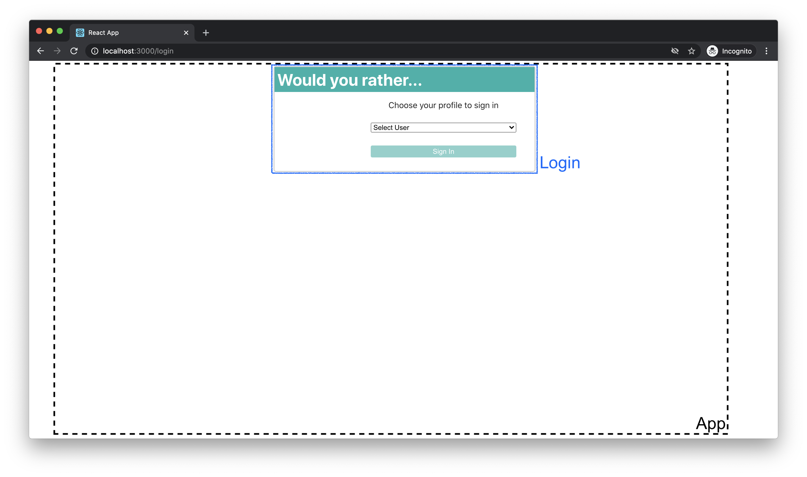
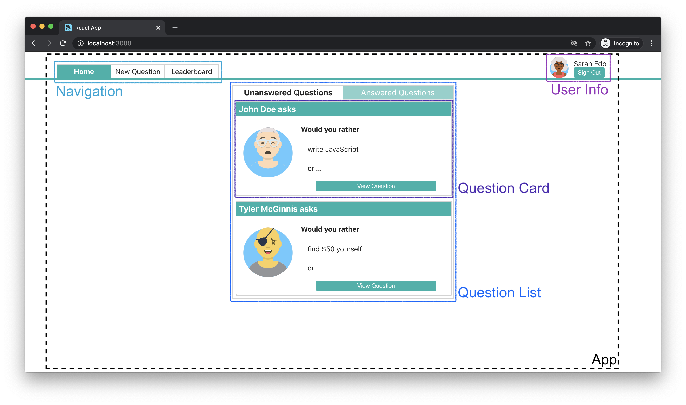
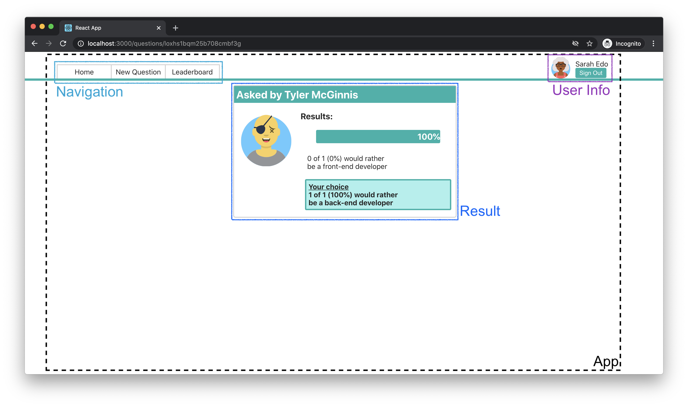
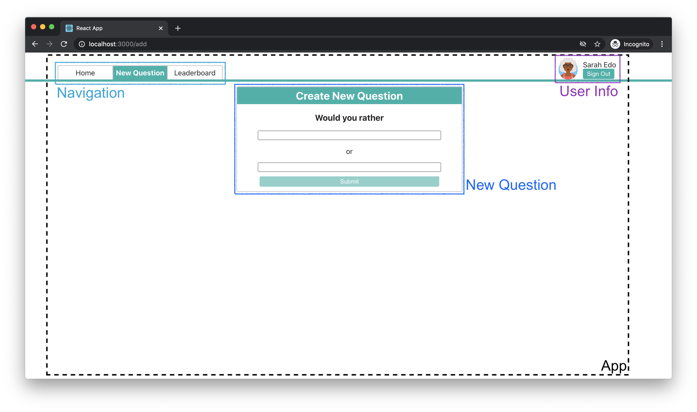
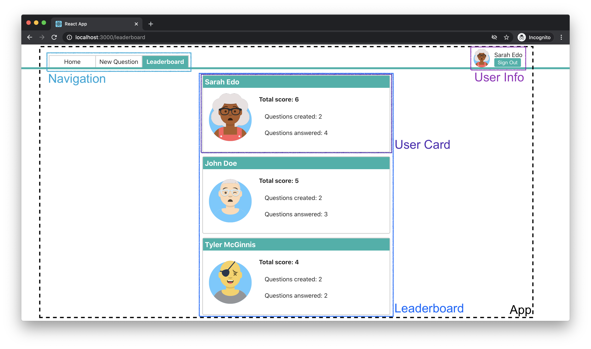

# Would You Rather?

## Getting Started

First, install dependencies

```
yarn install
```

Then, start the server at `localhost:3000`

```
yarn start
```

## Project Layout

### Views and Components

#### - Shared components

* **App** - the overall container for the project
* Only shows after logging in
	* **Navigation** - the navigation bar
	* **User Info** - shows current authorized user and a logout button

#### - Login Page

located at route `/login`


* **Login** - a sign in box

#### - Home Page

located at route `/`


* **Question List** - shows both answered and unanswered questions, listed from most recently added at the top, to oldest at the bottom
* **Question Card** - shows the author (avatar and name), option A and button linking to question page

#### - Question Page

located at route `/question/:id`



* **Question** - shows the author (avatar and name), and two options
	* if unanswered (**Vote**), shows options as radio buttons, as well as a submit button
	* if answered (**Result**), shows result from all users as well as choice of the current user

#### - New Question Page

located at route `/new`


* **New Question** - shows a form to fill in text for both options

#### - Leaderboard Page

located at route `/leaderboard`


* **Leaderboard** - shows all users ranked by score (created + answered questions) from high to low
* **User Card** - shows the author (avatar and name), and the number of created an answered questions, as well as the total score

### Events by Component

#### - Login
* *get* all **users** to choose from
* *set* **authedUser** upon logging in

#### - User Info
* *get* **authedUser** from **users** to display info
* *set* **authedUser** to `null` when logging out

#### - Question List
* *get* all **questions**
* *get* answered questions of **authedUser** from **users** to build two separate lists

#### - Question Card
* *get* a question from **questions** and its author from **users** to display

#### - Question
* *get* a question from **questions** based on id and its author from **users** to display
* *get* **authedUser** from **users** to determine whether the current user has answered this question, and
	* *set* current user's answer in both **questions** and **users** when not answered (Vote)
	* *get* stats from **questions** for this question when already answered (Result), and display the answer of **authedUser** from **users**

#### - New Question
* *get* **authedUser** to determine the author of new question
* *set* a new question in **questions**, and *set* the new question id to **authedUser** in **users**

#### - Leaderboard
* *get* all **users** and rank them based on contribution

#### - User Card
* *get* **users** to display info and score

### Data
```
{
  authedUser: userId
  questions: {
    questionId: {
      id: questionId,
      author: userId,
      timestamp,
      optionOne: {
        votes: [userId],
        text
      },
      optionTwo: {
        votes: [userId],
        text
      }
    }
  },
  users: {
    userId: {
      id: userId,
      name,
      avatarURL,
      answers: {
        questionId: 'optionOne' or 'optionTwo'
      }
      questions: [questionId]
    }
  }
}
```